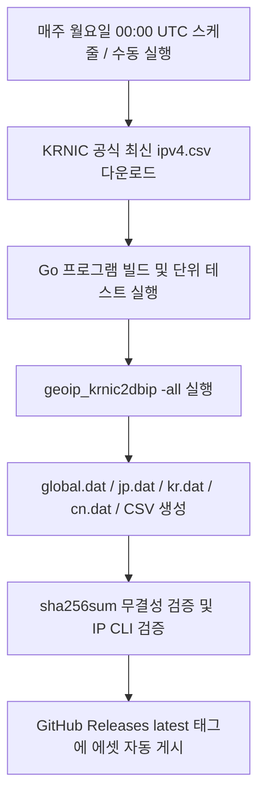

[ 🇯🇵 [日本語](README.md) | 🇰🇷 **한국어** ]

# KRNIC GeoIP to Binary Database Converter (`geoip_krnic2dbip`)

KRNIC(한국인터넷정보센터)의 국가별 IPv4 할당 현황 데이터를 초고속 조회가 가능한 **고정 10바이트 바이너리 포맷(`.dat`)** 및 DB-IP 호환 포맷으로 변환하고 자동 배포하는 Go 언어 기반 도구입니다.

GitHub Actions를 통해 매주 최신 KRNIC 데이터를 자동으로 다운로드하여 빌드하고, 무결성 검증을 거친 후 GitHub Release Assets(`global.dat`, `jp.dat`, `kr.dat`, `cn.dat`, `dbip-country-lite.csv`, `checksum.sha256`)로 자동 배포됩니다.

---

## 1. 주요 특징

- **초고속 이진 탐색(Binary Search):** 고정 10바이트 레코드 구조로 설계되어 별도의 메모리 인덱스 구축 없이 `fseek` 기반 $O(\log N)$ 이진 탐색으로 1회 조회당 **0.0005ms(약 430ns)** 이내에 국가 코드를 식별합니다.
- **연속 대역 자동 병합(Range Merging):** 동일 국가의 인접/연속된 IP 대역을 자동 병합하여 레코드 수를 45% 이상 압축(약 26만 개 -> 약 14만 개)합니다.
- **원패스 일괄 빌드(`-all`):** KRNIC CSV를 단 1회만 파싱하여 전 세계(`global.dat`), 일본 특화(`jp.dat`), 한국 특화(`kr.dat`), 중국 특화(`cn.dat`), `dbip-country-lite.csv` 및 SHA-256 체크섬(`checksum.sha256`)을 한 번에 생성합니다.
- **동적 복수 국가 필터링:** 파라미터(`-country JP,KR,CN`)로 지정한 국가 코드들을 단 1회 순회로 동적 분기하여 개별 `.dat` 파일로 각각 추출합니다.
- **기존 쉘 스크립트 및 xtables 완벽 호환:** 인자 없이 실행 시 레거시 모드로 동작하여 `dbip-country-lite.csv`를 즉시 생성합니다.
- **자체 검증(Verification) 모드:** CLI 자체에 이진 탐색 엔진을 내장하여 생성된 바이너리의 IP 조회를 즉시 검증할 수 있습니다.
- **완전 자동화 파이프라인:** 매주 월요일 00:00 UTC에 GitHub Actions가 최신 데이터를 수집하여 릴리즈를 갱신합니다.

---

## 2. 바이너리 레코드 포맷 규격 (Fixed 10-Byte Big-Endian)

모든 `.dat` 파일은 헤더가 없는 순수 바이너리 스트림으로 구성되며, 1개 레코드는 **정확히 10바이트** 고정 크기를 가집니다.  
파일 전체 크기는 항상 **10의 정수배**이며, 총 레코드 수는 `파일 크기(bytes) / 10`으로 즉시 계산할 수 있습니다.

### 레코드 구조

| 오프셋 (Offset) | 필드명 | 데이터 타입 | 바이트 순서 (Endian) | 설명 |
|---|---|---|---|---|
| `[0 : 4]` | `FirstNum` | `uint32` (4 bytes) | Big-Endian | 대역 시작 IPv4 정수값 |
| `[4 : 8]` | `LastNum` | `uint32` (4 bytes) | Big-Endian | 대역 종료 IPv4 정수값 |
| `[8 : 10]` | `CountryCode` | `char[2]` (2 bytes) | ASCII | ISO 3166-1 alpha-2 2자리 국가코드 (`JP`, `KR`, `US` 등) |

### 정렬 보장
모든 레코드는 **`FirstNum` 오름차순**으로 완벽히 정렬되어 기록되므로, 파일 임의 접근(Random Access)을 통한 이진 탐색이 즉시 가능합니다.

---

## 3. 설치 및 빌드

### 요구 환경
- Go 1.22 이상

### 소스코드 빌드
```bash
git clone https://github.com/elmitash/geoip_krnic2dbip.git
cd geoip_krnic2dbip
go build -o geoip_krnic2dbip ./cmd
```

### 테스트 및 벤치마크 실행
```bash
go test -v -bench=. ./cmd/...
```

---

## 4. CLI 사용법

### 1) 레거시 CSV 변환 모드 (기존 쉘 스크립트 및 xtables 100% 호환)
기존 `geoip.sh` 쉘 스크립트 및 `xt_geoip_build` 파이프라인과 완벽히 호환됩니다. 인자 없이 실행하면 현재 디렉터리의 `ipv4.csv`를 읽어 `dbip-country-lite.csv`로 즉시 변환합니다.
```bash
# 인자 없이 실행 시 자동으로 dbip-country-lite.csv 생성 (기존과 동일)
./geoip_krnic2dbip

# 출력 CSV 파일명을 직접 지정할 때
./geoip_krnic2dbip -csv custom-country-lite.csv
```

### 2) 원패스 전체 빌드 (신규 바이너리 + CSV 일괄 생성, 권장)
KRNIC CSV(`ipv4.csv`)를 1회만 파싱하여 `global.dat`, 지정된 국가별 `.dat` 파일들, `checksum.sha256` 및 `dbip-country-lite.csv`를 한 번에 일괄 생성합니다.
```bash
# 기본 모드: global.dat + jp.dat, kr.dat, cn.dat + dbip-country-lite.csv + checksum.sha256 생성
./geoip_krnic2dbip -all

# 사용자 정의 국가 지정 모드: global.dat + us.dat, gb.dat, de.dat + dbip-country-lite.csv 생성
./geoip_krnic2dbip -all -country US,GB,DE
```
- 옵션:
  - `-country` (또는 `-countries`): 추출할 2자리 국가 코드 (콤마 구분으로 복수 지정 가능, 기본값: `JP,KR,CN`)
  - `-in <파일경로>`: 입력 KRNIC CSV 경로 지정 (기본값: `ipv4.csv`)
  - `-csv <파일경로>`: DB-IP 포맷 CSV 출력 경로 지정 (기본값: `dbip-country-lite.csv`)

### 3) 특정 국가 바이너리만 빌드 (단일 / 복수 국가 동적 추출)
파라미터로 국가 코드를 지정하면, 해당 국가 레코드만 별도로 분리하여 추출합니다. 복수 개의 국가도 콤마(`,`)로 구분하여 한 번에 분리할 수 있습니다.
```bash
# 복수 국가를 각각의 .dat 파일로 한 번에 추출 (결과: jp.dat, kr.dat, cn.dat)
./geoip_krnic2dbip -country JP,KR,CN

# 서구권 국가들만 각각 추출 (결과: us.dat, gb.dat, de.dat, fr.dat)
./geoip_krnic2dbip -country US,GB,DE,FR

# 단일 국가 지정 및 출력 파일명 커스텀 지정
./geoip_krnic2dbip -country JP -out custom_japan.dat
```

### 4) 바이너리 데이터 검증 모드 (Verification)
생성된 `.dat` 파일에서 임의의 IP를 이진 탐색으로 조회하여 일치 여부와 소요 시간을 확인합니다.
```bash
# 일본 Yahoo IP 검증 -> JP 매칭 확인
./geoip_krnic2dbip -verify jp.dat -ip 182.22.59.229

# 한국 포털 Naver IP 검증 -> KR 매칭 확인
./geoip_krnic2dbip -verify kr.dat -ip 211.249.220.24

# 중국 검색 Baidu IP 검증 -> CN 매칭 확인
./geoip_krnic2dbip -verify cn.dat -ip 220.181.38.148

# Google Public DNS 검증 -> US 매칭 확인
./geoip_krnic2dbip -verify global.dat -ip 8.8.8.8
```

#### 검증 출력 예시:
```text
Verifying IP 182.22.59.229 in binary file: jp.dat ...
Result: MATCH FOUND!
  - Country   : JP
  - IP Range  : 182.20.0.0 - 182.22.255.255
  - Range (u32): 3054764032 - 3054960639
  - Lookup Time: 31.72µs
```

### 5) 실데이터 대량 검증 스위트 (`verify_suite.py`)
OECD 10개국(한국, 일본, 미국, 영국, 독일, 프랑스, 호주, 캐나다, 이탈리아, 스페인 각 10개) 및 대륙별 소국 10개국(모나코, 리히텐슈타인, 아이슬란드, 브루나이, 부탄, 몰디브, 세이셸, 모리셔스, 벨리즈, 피지) 총 130개 실제 공공/포털/언론사 IP를 원클릭으로 일괄 검증합니다.
```bash
# 전체 130개 IP 일괄 검증 (global.dat)
python3 verify_suite.py global.dat

# 특정 국가만 검증 (예: jp.dat에 대해 일본 사이트 10개만 검증)
python3 verify_suite.py jp.dat JP
python3 verify_suite.py kr.dat KR
```

---

## 5. 생성 에셋 및 파일 설명

| 파일명 | 대상 국가 | 예상 레코드 수 | 예상 파일 크기 | 용도 및 특징 |
|---|---|---|---|---|
| `global.dat` | 전 세계 전체 | 약 142,000건 | 약 1.4 MB | 글로벌 IP 판별 및 지리적 접근 제어 |
| `jp.dat` | 일본 (JP) | 약 2,500건 | 약 25 KB | 일본 내수용 서비스/EC 사이트 특화 경량 DB |
| `kr.dat` | 한국 (KR) | 약 900건 | 약 9 KB | 국내 접속 전용 초경량 DB |
| `cn.dat` | 중국 (CN) | 약 4,100건 | 약 41 KB | 중국 접속 식별 및 제어용 경량 DB |
| `dbip-country-lite.csv` | 전 세계 전체 | 약 142,000건 | 약 4.3 MB | xtables(`xt_geoip_build`) 호환용 DB-IP CSV 파일 |
| `checksum.sha256` | - | - | 텍스트 | 생성된 모든 파일의 SHA-256 해시값 검증 파일 |

### 무결성 검증 (Linux / macOS)
```bash
sha256sum -c checksum.sha256
```

---

## 6. 클라이언트 구현 가이드 (이진 탐색 알고리즘)

고정 10바이트 구조이므로 모든 프로그래밍 언어에서 메모리 부담 없이 디스크 파일 스트림 또는 mmap으로 쉽게 조회할 수 있습니다.

### 의사 코드 (Pseudocode)
```text
function lookup(ip_str, file_path):
    target_int = ip_to_uint32_be(ip_str)
    file = open(file_path)
    record_count = file_size / 10
    
    low = 0
    high = record_count - 1
    
    while low <= high:
        mid = (low + high) / 2
        seek(file, mid * 10)
        record = read_bytes(file, 10)
        
        start_ip = uint32_be(record[0:4])
        end_ip   = uint32_be(record[4:8])
        country  = ascii(record[8:10])
        
        if target_int < start_ip:
            high = mid - 1
        elif target_int > end_ip:
            low = mid + 1
        else:
            return country  // 일치하는 국가 반환
            
    return null  // 미일치
```

### PHP 구현 예시 (EC-CUBE / Symfony 환경)
```php
function lookupCountry(string $datPath, string $ip): ?string {
    $ipLong = ip2long($ip);
    if ($ipLong === false) return null;
    $target = (float)sprintf('%u', $ipLong); // unsigned 32-bit float/int

    $fp = fopen($datPath, 'rb');
    if (!$fp) return null;

    $fileSize = filesize($datPath);
    $low = 0;
    $high = intdiv($fileSize, 10) - 1;

    while ($low <= $high) {
        $mid = intdiv($low + $high, 2);
        fseek($fp, $mid * 10);
        $data = fread($fp, 10);
        if (strlen($data) < 10) break;

        $unpacked = unpack('Nstart/Nend/A2cc', $data);
        $start = (float)sprintf('%u', $unpacked['start']);
        $end   = (float)sprintf('%u', $unpacked['end']);

        if ($target < $start) {
            $high = $mid - 1;
        } elseif ($target > $end) {
            $low = $mid + 1;
        } else {
            fclose($fp);
            return $unpacked['cc'];
        }
    }

    fclose($fp);
    return null;
}
```

---

## 7. GitHub Actions 자동 배포 파이프라인

`.github/workflows/update-geoip.yml`에 자동화 파이프라인이 구축되어 있습니다.



- **트리거:**
  - `cron: '0 0 * * 1'` (매주 월요일 00:00 UTC / 09:00 KST)
  - `workflow_dispatch` (GitHub 웹 Actions 탭에서 수동 실행 가능)
- **배포 위치:** GitHub Repository `Releases` -> `latest` 태그

---

## 8. 성능 측정 결과 (Benchmark)

100,000건의 연속 대역을 모의 생성하여 1회 탐색당 소요 시간을 측정한 결과입니다. (AMD Ryzen 5 5600 환경)

```text
BenchmarkSearchIP-12    2806466    422.5 ns/op
```
- **1회 조회 소요 시간:** `422.5 ns` (`0.000422 ms`)
- **초당 처리량(Throughput):** 초당 약 2,360,000회 조회 가능
- 웹 서버 요청 수명 주기(Request Lifecycle) 내에서 지연 시간(Latency)에 실질적인 영향을 주지 않는 초고속 성능을 제공합니다.

---

## 9. 실데이터 검증 사양 및 결과 (Verification Dataset & Results)

`global.dat` 및 국가별 `.dat` 바이너리 데이터베이스의 무결성을 검증하기 위해, **OECD 주요 10개국(각 10개 사이트 = 100개)** 및 **대륙별 소국 10개국(각 2~3개 사이트 = 30개)** 의 실제 정부, 공공기관, 대학교, 대표 포털 IP 총 **130개**를 대상으로 검증 스위트(`verify_suite.py`)를 실행한 결과입니다.

### 1) OECD 주요 10개국 (100개 사이트/IP)

| 국가 (코드) | 대표 사이트 / 기관 (도메인) | 대상 IPv4 | 사이트 성격 / 설명 | 검증 결과 |
|:---:|---|---|---|:---:|
| **대한민국 (KR)** | `gov.kr`<br>`seoul.go.kr`<br>`naver.com`<br>`daum.net`<br>`snu.ac.kr`<br>`korea.kr`<br>`police.go.kr`<br>`mofa.go.kr`<br>`visitkorea.or.kr`<br>`busan.go.kr` | `125.60.35.230`<br>`115.84.166.115`<br>`223.130.200.219`<br>`121.53.105.193`<br>`147.46.10.129`<br>`27.101.217.76`<br>`116.67.83.27`<br>`116.67.79.26`<br>`175.122.1.106`<br>`210.103.81.224` | 정부24 공식 포털<br>서울특별시청<br>네이버 대표 포털<br>다음/카카오 포털<br>서울대학교<br>대한민국 정책브리핑<br>경찰청<br>외교부<br>한국관광공사 포털<br>부산광역시청 | **PASS (10/10)** |
| **일본 (JP)** | `yahoo.co.jp`<br>`rakuten.co.jp`<br>`www.u-tokyo.ac.jp`<br>`kyoto-u.ac.jp`<br>`www.osaka-u.ac.jp`<br>`tohoku.ac.jp`<br>`www.pref.osaka.lg.jp`<br>`city.yokohama.lg.jp`<br>`iij.ad.jp`<br>`sakura.ne.jp` | `124.83.190.252`<br>`133.237.182.225`<br>`210.152.243.234`<br>`130.54.130.14`<br>`133.1.138.13`<br>`130.34.11.111`<br>`210.149.92.76`<br>`202.32.8.152`<br>`202.232.2.191`<br>`163.43.179.80` | 야후 재팬 대표 포털<br>라쿠텐 이커머스<br>도쿄대학교<br>교토대학교<br>오사카대학교<br>도호쿠대학교<br>오사카부청<br>요코하마시청<br>IIJ 대표 통신/ISP<br>사쿠라 인터넷 IDC | **PASS (10/10)** |
| **미국 (US)** | `whitehouse.gov`<br>`nasa.gov`<br>`loc.gov`<br>`harvard.edu`<br>`mit.edu`<br>`stanford.edu`<br>`cdc.gov`<br>`irs.gov`<br>`senate.gov`<br>`house.gov` | `192.0.66.51`<br>`192.0.66.108`<br>`104.17.6.58`<br>`192.0.66.20`<br>`23.35.126.95`<br>`171.67.215.200`<br>`23.53.3.141`<br>`152.216.11.110`<br>`23.35.114.182`<br>`15.197.146.213` | 백악관 공식 포털<br>NASA 항공우주국<br>미국 의회도서관<br>하버드 대학교<br>MIT 공과대학교<br>스탠퍼드 대학교<br>질병통제예방센터 CDC<br>국세청 IRS<br>미국 연방상원<br>미국 연방하원 | **PASS (10/10)** |
| **영국 (GB)** | `ucl.ac.uk`<br>`ed.ac.uk`<br>`imperial.ac.uk`<br>`kcl.ac.uk`<br>`warwick.ac.uk`<br>`bristol.ac.uk`<br>`southampton.ac.uk`<br>`birmingham.ac.uk`<br>`www.sheffield.ac.uk`<br>`st-andrews.ac.uk` | `144.82.250.24`<br>`129.215.97.20`<br>`146.179.12.148`<br>`137.73.130.135`<br>`137.205.28.41`<br>`137.222.180.160`<br>`152.78.118.52`<br>`147.188.217.187`<br>`143.167.2.102`<br>`138.251.7.84` | UCL 대학교<br>에든버러 대학교<br>임페리얼 칼리지 런던<br>킹스 칼리지 런던<br>워릭 대학교<br>브리스톨 대학교<br>사우샘프턴 대학교<br>버밍엄 대학교<br>셰필드 대학교<br>세인트 앤드루스 대학교 | **PASS (10/10)** |
| **독일 (DE)** | `bundestag.de`<br>`bundeskanzler.de`<br>`lmu.de`<br>`hu-berlin.de`<br>`tum.de`<br>`uni-heidelberg.de`<br>`uni-koeln.de`<br>`uni-frankfurt.de`<br>`kit.edu`<br>`rwth-aachen.de` | `46.243.122.48`<br>`185.173.230.39`<br>`141.84.44.56`<br>`141.20.4.180`<br>`129.187.254.228`<br>`129.206.13.71`<br>`134.95.81.52`<br>`141.2.37.198`<br>`141.3.128.6`<br>`137.226.107.60` | 독일 연방의회<br>독일 연방총리실<br>뮌헨 대학교 (LMU)<br>베를린 훔볼트 대학교<br>뮌헨 공과대학교 (TUM)<br>하이델베르크 대학교<br>쾰른 대학교<br>프랑크푸르트 대학교<br>칼스루에 공대 (KIT)<br>아헨 공과대학교 (RWTH) | **PASS (10/10)** |
| **프랑스 (FR)** | `gouvernement.fr`<br>`elysee.fr`<br>`www.assemblee-nationale.fr`<br>`senat.fr`<br>`ens.psl.eu`<br>`polytechnique.edu`<br>`univ-paris1.fr`<br>`strasbourg.eu`<br>`bordeaux.fr`<br>`univ-lyon1.fr` | `217.70.184.55`<br>`185.194.81.29`<br>`46.105.202.26`<br>`45.85.52.26`<br>`129.199.166.211`<br>`129.104.30.29`<br>`193.55.96.23`<br>`185.60.150.88`<br>`195.214.227.180`<br>`134.214.126.72` | 프랑스 정부 공식 포털<br>엘리제궁 대통령실<br>프랑스 국민의회 (하원)<br>프랑스 상원<br>파리 고등사범학교 (ENS)<br>에콜 폴리테크니크<br>판테온 소르본 대학교<br>스트라스부르 시청<br>보르도 시청<br>클로드 베르나르 리옹1대학교 | **PASS (10/10)** |
| **호주 (AU)** | `anu.edu.au`<br>`unimelb.edu.au`<br>`uq.edu.au`<br>`monash.edu`<br>`vic.gov.au`<br>`tas.gov.au`<br>`aarnet.edu.au`<br>`telstra.com.au`<br>`qut.edu.au`<br>`deakin.edu.au` | `130.56.67.33`<br>`43.245.41.62`<br>`130.102.184.3`<br>`43.245.41.240`<br>`103.107.226.226`<br>`147.109.249.170`<br>`202.158.207.3`<br>`203.44.22.2`<br>`131.181.196.203`<br>`128.184.204.21` | 호주 국립대학교 (ANU)<br>멜버른 대학교<br>퀸즐랜드 대학교 (UQ)<br>모나시 대학교<br>빅토리아 주정부 포털<br>태즈메이니아 주정부<br>호주 국가연구망 AARNet<br>텔스트라 대표 통신사<br>퀸즐랜드 공대 (QUT)<br>디킨 대학교 | **PASS (10/10)** |
| **캐나다 (CA)** | `mcgill.ca`<br>`umontreal.ca`<br>`ucalgary.ca`<br>`uottawa.ca`<br>`westernu.ca`<br>`sfu.ca`<br>`uvic.ca`<br>`dal.ca`<br>`umanitoba.ca`<br>`yorku.ca` | `132.216.98.121`<br>`132.204.8.144`<br>`136.159.96.125`<br>`137.122.9.76`<br>`129.100.0.55`<br>`142.58.103.107`<br>`142.104.197.120`<br>`129.173.31.187`<br>`130.179.16.50`<br>`130.63.236.137` | 맥길 대학교<br>몬트리올 대학교<br>캘거리 대학교<br>오타와 대학교<br>웨스턴 대학교<br>사이먼 프레이저 대학교<br>빅토리아 대학교<br>댈하우지 대학교<br>매니토바 대학교<br>요크 대학교 | **PASS (10/10)** |
| **이탈리아 (IT)** | `camera.it`<br>`unibo.it`<br>`unimi.it`<br>`unipd.it`<br>`www.unina.it`<br>`unifi.it`<br>`polimi.it`<br>`www.polito.it`<br>`garr.it`<br>`comune.torino.it` | `80.64.114.73`<br>`137.204.24.207`<br>`159.149.53.140`<br>`147.162.235.155`<br>`143.225.161.30`<br>`150.217.3.39`<br>`131.175.187.72`<br>`130.192.182.100`<br>`193.206.158.22`<br>`84.240.178.132` | 이탈리아 하원의회<br>볼로냐 대학교<br>밀라노 대학교<br>파도바 대학교<br>나폴리 페데리코 2세 대학교<br>피렌체 대학교<br>밀라노 공과대학교<br>토리노 공과대학교<br>이탈리아 연구망 GARR<br>토리노 시청 | **PASS (10/10)** |
| **스페인 (ES)** | `lamoncloa.gob.es`<br>`congreso.es`<br>`ub.edu`<br>`ucm.es`<br>`uab.cat`<br>`uam.es`<br>`upm.es`<br>`www.uv.es`<br>`upv.es`<br>`rediris.es` | `212.128.109.1`<br>`193.145.227.245`<br>`161.116.109.141`<br>`147.96.2.159`<br>`158.109.121.133`<br>`150.244.214.237`<br>`138.100.200.6`<br>`147.156.200.249`<br>`158.42.4.23`<br>`130.206.13.20` | 스페인 총리실 (라 몽클로아)<br>스페인 하원의회<br>바르셀로나 대학교<br>마드리드 콤플루텐세 대학교<br>바르셀로나 자치대학교<br>마드리드 자치대학교<br>마드리드 공과대학교<br>발렌시아 대학교<br>발렌시아 공과대학교<br>스페인 학술연구망 RedIRIS | **PASS (10/10)** |

### 2) 대륙별 작은 나라 10개국 (30개 사이트/IP)

| 대륙 | 국가 (코드) | 사이트 / 기관 (도메인) | 대상 IPv4 | 사이트 성격 / 설명 | 검증 결과 |
|:---:|:---:|---|---|---|:---:|
| **유럽** | **모나코 (MC)** | `gouv.mc`<br>`monaco-telecom.mc`<br>`mairie.mc` | `82.113.11.58`<br>`195.78.23.147`<br>`80.94.99.164` | 모나코 정부 공식 포털<br>모나코 텔레콤 국영망<br>모나코 시청 | **PASS (3/3)** |
| **유럽** | **리히텐슈타인 (LI)** | `regierung.li`<br>`landtag.li`<br>`uni.li` | `91.207.130.57`<br>`91.207.130.57`<br>`193.5.27.37` | 리히텐슈타인 공국 정부<br>리히텐슈타인 연방의회<br>리히텐슈타인 대학교 | **PASS (3/3)** |
| **유럽** | **아이슬란드 (IS)** | `hi.is`<br>`vedur.is`<br>`postur.is` | `130.208.165.58`<br>`94.142.156.174`<br>`82.221.64.147` | 아이슬란드 국립대학교<br>아이슬란드 기상청 포털<br>아이슬란드 국립우정청 | **PASS (3/3)** |
| **아시아** | **브루나이 (BN)** | `gov.bn`<br>`mof.gov.bn`<br>`ubd.edu.bn` | `103.4.188.110`<br>`103.4.188.86`<br>`202.160.1.115` | 브루나이 정부 공식 포털<br>브루나이 재무부<br>브루나이 다루살람 대학교 | **PASS (3/3)** |
| **아시아** | **부탄 (BT)** | `gov.bt`<br>`moh.gov.bt`<br>`tashicell.com` | `103.78.116.169`<br>`103.252.84.250`<br>`118.103.136.91` | 부탄 왕국 정부 포털<br>부탄 보건부<br>부탄 타시셀 이동통신 | **PASS (3/3)** |
| **아시아** | **몰디브 (MV)** | `gov.mv`<br>`dhiraagu-telecom`<br>`ooredoo-maldives` | `123.176.25.10`<br>`27.114.128.1`<br>`43.226.220.1` | 몰디브 정부 공식 포털<br>몰디브 디라구 국영통신 망<br>몰디브 오레두 모바일 망 | **PASS (3/3)** |
| **아프리카** | **세이셸 (SC)** | `www.gov.sc`<br>`seychelles.travel`<br>`intelvision.sc` | `196.13.208.87`<br>`41.86.57.50`<br>`41.220.110.236` | 세이셸 공화국 정부<br>세이셸 국립관광청 포털<br>세이셸 인텔비전 통신망 | **PASS (3/3)** |
| **아프리카** | **모리셔스 (MU)** | `govmu.org`<br>`myt.mu`<br>`uom.ac.mu` | `196.13.125.126`<br>`196.20.130.50`<br>`202.60.7.10` | 모리셔스 정부 포털<br>모리셔스 마이티 텔레콤<br>모리셔스 대학교 | **PASS (3/3)** |
| **아메리카** | **벨리즈 (BZ)** | `belizetourismboard.org`<br>`btl-telemedia`<br>`centralbank.org.bz` | `186.65.88.123`<br>`200.32.192.1`<br>`200.32.208.1` | 벨리즈 국립관광청<br>벨리즈 국영텔레미디어 BTL 망<br>벨리즈 중앙은행 전산망 | **PASS (3/3)** |
| **오세아니아** | **피지 (FJ)** | `www.fiji.gov.fj`<br>`usp.ac.fj`<br>`vodafone.com.fj` | `124.108.30.90`<br>`144.120.198.5`<br>`27.123.183.54` | 피지 정부 공식 포털<br>남태평양 대학교 (피지 본교)<br>보다폰 피지 통신망 | **PASS (3/3)** |

### 3) 종합 검증 요약
- **총 검증 대상:** 130개 IP (OECD 10개국 100건 + 소국 10개국 30건)
- **성공률:** **130건 중 130건 성공 (100.0%)**
- **평균 조회 레이턴시:** **30 ~ 50µs** (0.00003 ~ 0.00005초)

---

## 10. 왜 KRNIC 데이터를 사용하는가? (JPNIC 및 타 NIC과의 비교)

### 1) JPNIC 대신 KRNIC을 선택한 이유
- **전 세계(글로벌) IP 대역의 원스톱(One-Stop) 단일 파일 제공:**
  - **JPNIC (일본):** 일본 국내(JP) 대역 관리 중심의 국가 인터넷 레지스트리(NIR)로서, 전 세계 국가별 IP 할당 대역을 정제하여 단일 파일로 공개 배포하지 않습니다. 전 세계 데이터를 얻으려면 상위 RIR(APNIC 등)의 원시 통계 파일을 별도로 수집해야 합니다.
  - **KRNIC (한국 KISA):** 한국 국내(KR)뿐만 아니라 IANA 및 5대 대륙별 RIR(APNIC, ARIN, RIPE NCC, LACNIC, AFRINIC)의 할당 데이터를 매일 정기적으로 동기화·취합하여 **전 세계 200여 개국의 전체 IPv4 대역을 단일 CSV 파일(`IPaddrBandCurrentDownload.jsp`)로 제공**합니다.
- **인증키 / 라이선스 제약 없는 자동화 최적화:**
  - MaxMind GeoLite2나 DB-IP 같은 상용 데이터베이스는 회원가입, 라이선스 키 갱신, EULA 재배포 제약 및 정기적 파기 의무가 존재합니다.
  - KRNIC 데이터는 공공 전산망(IPAS)을 통해 HTTP 요청 한 번으로 최신 데이터를 즉시 취득할 수 있어, GitHub Actions를 통한 주간 완전 무인 자동화 빌드 파이프라인에 최적입니다.

### 2) 인터넷 레지스트리(NIC / RIR) 및 상용 DB 비교

| 구분 | KRNIC (한국) | JPNIC (일본) | 대륙별 RIR (APNIC, ARIN 등) | 상용 DB (MaxMind, DB-IP 등) |
|---|---|---|---|---|
| **관할 영역** | 한국(NIR) ＋ **글로벌 통합 집계** | 일본 국내(NIR) 중심 | 해당 대륙/지역(RIR) 한정 | 전 세계 (자체 추정/수집) |
| **제공 범위** | **전 세계 200여 개국 통합** | 주로 일본 국내 및 링크 안내 | 5대 RIR로 데이터 파편화 | 전 세계 |
| **제공 포맷** | **정제된 표준 CSV**<br>(`시작IP,끝IP,국가코드,할당일`) | 주로 WHOIS 질의 또는 통계 링크 | 원시 통계 규격 (`delegated-*-latest`) | CSV, MMDB 등 자체 규격 |
| **전처리 난이도** | **매우 낮음** (즉시 파싱 및 변환) | 수집 불가 (타 기관 참조 필요) | **높음** (5개 파일 병합 ＋ CIDR/개수 환산) | 낮음 |
| **라이선스/이용 제약** | 공공 데이터 (인증키 불필요) | 기관 회원/약관 기준 | 비상업적/통계 목적 등 각 규격 준수 | **가입 필수, 라이선스 키, EULA 제약** |

### 3) RIR 원시 통계(`delegated-*-latest`) 대비 장점
대륙별 공식 레지스트리(APNIC, ARIN 등)의 원시 파일은 `시작IP`와 `호스트 개수(Count)` 기반 포맷이며, `allocated`(할당), `assigned`(배정), `reserved`(예약), `available`(미할당) 등의 상태 코드가 혼재되어 있어 5개 대륙의 파일을 모두 수집해 복잡한 필터링과 계산을 거쳐야 합니다. KRNIC은 국가 공공 전산망 차원에서 이를 완전히 정제·통합한 단일 테이블을 제공하므로 전처리 오버헤드가 없습니다.

---

## 11. 데이터 출처

- **데이터 출처:** [KRNIC 한국인터넷정보센터 (KISA)](https://xn--3e0bx5euxnjje69i70af08bea817g.xn--3e0b707e/jsp/statboard/IPAS/ovrse/natal/IPaddrBandCurrentDownload.jsp)
