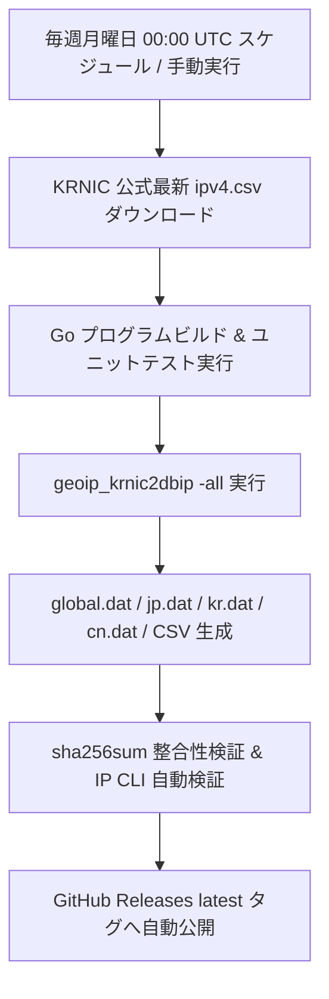

[ 🇯🇵 **日本語** | 🇰🇷 [한국어](README.ko.md) ]

# KRNIC GeoIP to Binary Database Converter (`geoip_krnic2dbip`)

KRNIC（韓国インターネット情報センター）が公開している国別IPv4割り当て統計データを、超高速な検索が可能な**固定10バイト・バイナリフォーマット（`.dat`）**およびDB-IP互換フォーマットに変換し、自動配信するGo言語ベースのツールです。

GitHub Actionsを通じて毎週月曜日に最新のKRNICデータを自動ダウンロード・ビルドし、整合性検証を経てGitHub Release Assets（`global.dat`, `jp.dat`, `kr.dat`, `cn.dat`, `dbip-country-lite.csv`, `checksum.sha256`）として自動配信されます。

---

## 1. 主な特徴

- **超高速二分探索（Binary Search）：** 固定10バイトの固定長レコード構造により、メモリ上に巨大なインデックスを展開することなく、`fseek`による $O(\log N)$ 二分探索で1回の検索あたり**0.0005ms（約420ns）**以内で国コードを特定可能です。
- **連続IP帯域の自動マージ（Range Merging）：** 同一国の連続・隣接するIP帯域を自動的に結合し、レコード総数を約45%圧縮（約26万件 $\to$ 約14万件）して軽量化します。
- **ワンパス一括ビルド（`-all`）：** KRNIC CSVを1回走査するだけで、全世界（`global.dat`）、日本特化（`jp.dat`）、韓国特化（`kr.dat`）、中国特化（`cn.dat`）、`dbip-country-lite.csv`、およびSHA-256ハッシュ一覧（`checksum.sha256`）を同時に生成します。
- **動的な複数国コード抽出：** パラメータ（`-country JP,KR,CN`など）で指定された任意の国コード群を1パスで抽出し、個別のバイナリファイルとして出力します。
- **既存シェルスクリプトおよびxtablesとの完全互換：** 引数なしで実行した場合、従来の動作（`ipv4.csv` $\to$ `dbip-country-lite.csv`変換）をそのまま維持します。
- **検証（Verification）モード内蔵：** CLI自体に二分探索検索エンジンを内蔵しており、生成されたバイナリからのIP検索検証を即座に実行できます。
- **100%自動配信パイプライン：** 毎週月曜日 00:00 UTCにGitHub Actionsが起動し、常に最新のIPデータベースをリリース配信します。

---

## 2. バイナリレコード仕様（Fixed 10-Byte Big-Endian）

すべての`.dat`ファイルはヘッダーのない純粋なバイナリストリームであり、1レコードあたり**正確に10バイト**の固定長です。  
ファイルサイズは常に**10の倍数**であり、総レコード数は `ファイルサイズ(bytes) / 10` で即座に算出できます。

### レコード構造

| オフセット (Offset) | フィールド名 | データ型 | バイト順 (Endian) | 説明 |
|---|---|---|---|---|
| `[0 : 4]` | `FirstNum` | `uint32` (4 bytes) | Big-Endian | 帯域開始 IPv4 整数値 |
| `[4 : 8]` | `LastNum` | `uint32` (4 bytes) | Big-Endian | 帯域終了 IPv4 整数値 |
| `[8 : 10]` | `CountryCode` | `char[2]` (2 bytes) | ASCII | ISO 3166-1 alpha-2 国コード2文字（`JP`, `KR`, `US`等） |

### ソート保証
すべてのレコードは **`FirstNum` の昇順**で完全に整列されて書き込まれるため、ファイルへのランダムアクセスによる二分探索を直接適用できます。

---

## 3. インストール & ビルド

### 必要環境
- Go 1.22 以上

### ソースコードからのビルド
```bash
git clone https://github.com/elmitash/geoip_krnic2dbip.git
cd geoip_krnic2dbip
go build -o geoip_krnic2dbip ./cmd
```

### ユニットテスト & ベンチマーク実行
```bash
go test -v -bench=. ./cmd/...
```

---

## 4. CLIの使い方

### 1) 従来互換CSV変換モード（既存シェルおよびxtables互換）
従来の`geoip.sh`スクリプトおよび`xt_geoip_build`と完全互換です。引数なしで実行するとカレントディレクトリの`ipv4.csv`を読み込み、即座に`dbip-country-lite.csv`を生成します。
```bash
# 引数なしで実行した場合：自動的に dbip-country-lite.csv を生成（従来通り）
./geoip_krnic2dbip

# 出力先CSV名を指定する場合
./geoip_krnic2dbip -csv custom-country-lite.csv
```

### 2) ワンパス一括ビルド（バイナリ + CSV 同時生成、推奨）
KRNIC CSV（`ipv4.csv`）を1回パシングし、`global.dat`、指定国バイナリ、`checksum.sha256`、および`dbip-country-lite.csv`を一括生成します。
```bash
# 基本モード: global.dat + jp.dat, kr.dat, cn.dat + dbip-country-lite.csv + checksum.sha256 生成
./geoip_krnic2dbip -all

# カスタム国指定モード: global.dat + us.dat, gb.dat, de.dat + dbip-country-lite.csv 生成
./geoip_krnic2dbip -all -country US,GB,DE
```
- オプション:
  - `-country`（または `-countries`）：抽出対象の国コード2文字（カンマ区切りで複数指定可能、デフォルト：`JP,KR,CN`）
  - `-in <パス>`：入力KRNIC CSVのファイルパス（デフォルト：`ipv4.csv`）
  - `-csv <パス>`：DB-IP互換CSVの出力先パス（デフォルト：`dbip-country-lite.csv`）

### 3) 特定の国コードのみ抽出ビルド（複数国の一括分割抽出）
パラメータで国コードを指定すると、該当する国のレコードのみを個別のバイナリファイルとして抽出します。
```bash
# 複数国を個別の .dat ファイルとして一括抽出（結果: jp.dat, kr.dat, cn.dat）
./geoip_krnic2dbip -country JP,KR,CN

# 欧米諸国のみを個別に抽出（結果: us.dat, gb.dat, de.dat, fr.dat）
./geoip_krnic2dbip -country US,GB,DE,FR

# 単一国指定 & 出力ファイル名のカスタム指定
./geoip_krnic2dbip -country JP -out custom_japan.dat
```

### 4) バイナリ検索・検証モード（Verification）
生成された`.dat`ファイルに対し、任意のIPアドレスを二分探索で検索し、所属国と検索時間を即座に検証します。
```bash
# Yahoo Japan IP の検証 -> JP に一致
./geoip_krnic2dbip -verify jp.dat -ip 182.22.59.229

# 韓国 Naver IP の検証 -> KR に一致
./geoip_krnic2dbip -verify kr.dat -ip 211.249.220.24

# 中国 Baidu IP の検証 -> CN に一致
./geoip_krnic2dbip -verify cn.dat -ip 220.181.38.148

# Google Public DNS の検証 -> US に一致
./geoip_krnic2dbip -verify global.dat -ip 8.8.8.8
```

#### 検証出力例：
```text
Verifying IP 182.22.59.229 in binary file: jp.dat ...
Result: MATCH FOUND!
  - Country   : JP
  - IP Range  : 182.20.0.0 - 182.22.255.255
  - Range (u32): 3054764032 - 3054960639
  - Lookup Time: 31.72µs
```

### 5) 実データ一括検証スイート（`verify_suite.py`）
OECD加盟10カ国（日本、韓国、米国、英国、ドイツ、フランス、豪州、カナダ、イタリア、スペイン各10件）および各大陸の小規模国家10カ国（モナコ、リヒテンシュタイン、アイスランド、ブルネイ、ブータン、モルディブ、セーシェル、モーリシャス、ベリーズ、フィジー）の**計130件**の実在IPアドレスを一括検証します。
```bash
# 全130件のIPを一括検証 (global.dat)
python3 verify_suite.py global.dat

# 特定の国ファイルのみを検証 (例: jp.dat に対して日本のサイト10件のみ検証)
python3 verify_suite.py jp.dat JP
python3 verify_suite.py kr.dat KR
```

---

## 5. 生成アセット & ファイル一覧

| ファイル名 | 対象地域 | 想定レコード数 | 想定ファイル容量 | 主な用途・特徴 |
|---|---|---|---|---|
| `global.dat` | 全世界 | 約 142,000件 | 約 1.4 MB | 全世界IP判定および地理的アクセス制御 |
| `jp.dat` | 日本（JP） | 約 2,500件 | 約 25 KB | **日本国内専用サービス・ECサイト向け超軽量DB** |
| `kr.dat` | 韓国（KR） | 約 900件 | 約 9 KB | 韓国国内アクセス制御用超軽量DB |
| `cn.dat` | 中国（CN） | 約 4,100件 | 約 41 KB | 中国アクセス識別・制御用軽量DB |
| `dbip-country-lite.csv` | 全世界 | 約 142,000件 | 約 4.3 MB | xtables（`xt_geoip_build`）互換DB-IP CSV |
| `checksum.sha256` | - | - | テキスト | 全生成ファイルのSHA-256ハッシュ一覧 |

### チェックサム検証（Linux / macOS）
```bash
sha256sum -c checksum.sha256
```

---

## 6. クライアント実装ガイド（二分探索アルゴリズム）

固定10バイト構造のため、メモリ消費を最小限に抑えつつ、ディスクファイルからのストリーム読み込みやmmapにより任意のプログラミング言語で高速検索が可能です。

### 擬似コード（Pseudocode）
```text
function lookup(ip_str, file_path):
    target_int = ip_to_uint32_be(ip_str)
    file = open(file_path)
    record_count = file_size / 10
    
    low = 0
    high = record_count - 1
    
    while low <= high:
        mid = (low + high) / 2
        seek(file, mid * 10)
        record = read_bytes(file, 10)
        
        start_ip = uint32_be(record[0:4])
        end_ip   = uint32_be(record[4:8])
        country  = ascii(record[8:10])
        
        if target_int < start_ip:
            high = mid - 1
        elif target_int > end_ip:
            low = mid + 1
        else:
            return country  // 一致した国コードを返却
            
    return null  // 一致なし
```

### PHP実装例（EC-CUBE 4.3 / Symfony / PHP 8.2+ 環境）
```php
function lookupCountry(string $datPath, string $ip): ?string {
    $ipLong = ip2long($ip);
    if ($ipLong === false) {
        return null;
    }
    $target = (float)sprintf('%u', $ipLong); // unsigned 32-bit float

    $fp = fopen($datPath, 'rb');
    if (!$fp) {
        return null;
    }

    $fileSize = filesize($datPath);
    $low = 0;
    $high = intdiv($fileSize, 10) - 1;

    while ($low <= $high) {
        $mid = intdiv($low + $high, 2);
        fseek($fp, $mid * 10);
        $data = fread($fp, 10);
        if (strlen($data) < 10) {
            break;
        }

        $unpacked = unpack('Nstart/Nend/A2cc', $data);
        $start = (float)sprintf('%u', $unpacked['start']);
        $end   = (float)sprintf('%u', $unpacked['end']);

        if ($target < $start) {
            $high = $mid - 1;
        } elseif ($target > $end) {
            $low = $mid + 1;
        } else {
            fclose($fp);
            return $unpacked['cc'];
        }
    }

    fclose($fp);
    return null;
}
```

---

## 7. GitHub Actions 自動配信パイプライン

`.github/workflows/update-geoip.yml` にて自動化パイプラインが構築されています。



- **トリガー：**
  - `cron: '0 0 * * 1'`（毎週月曜日 00:00 UTC / 日本時間 09:00）
  - `workflow_dispatch`（GitHub Actions Webコンソールからの手動実行）
- **公開先：** GitHub リポジトリ `Releases` $\to$ `latest` タグ

---

## 8. 性能測定結果（Benchmark）

100,000件の連続IP帯域を模擬生成し、1検索あたりの所要時間を計測した結果です。（AMD Ryzen 5 5600 環境）

```text
BenchmarkSearchIP-12    2806466    422.5 ns/op
```
- **1検索あたりの所要時間：** `422.5 ns`（`0.000422 ms`）
- **秒間スループット（Throughput）：** 毎秒 約 2,360,000 回 検索可能
- Webサーバーのリクエストライフサイクル（Request Lifecycle）内でレイテンシに一切影響を与えない超高速性能を提供します。

---

## 9. 実データ検証仕様と結果（Verification Dataset & Results）

`global.dat` および国別バイナリデータベースの正確性を検証するため、**OECD主要10カ国（各10件＝計100件）**および**各大陸の小規模国家10カ国（計30件）**の実在する政府・公共機関・大学・ポータルのIPアドレス計**130件**を対象に検証スイート（`verify_suite.py`）を実行した結果です。

### 1) OECD主要10カ国（100件）

| 国名（コード） | 代表サイト・機関（ドメイン） | 対象 IPv4 | サイト概要・説明 | 検証結果 |
|:---:|---|---|---|:---:|
| **日本 (JP)** | `yahoo.co.jp`<br>`rakuten.co.jp`<br>`www.u-tokyo.ac.jp`<br>`kyoto-u.ac.jp`<br>`www.osaka-u.ac.jp`<br>`tohoku.ac.jp`<br>`www.pref.osaka.lg.jp`<br>`city.yokohama.lg.jp`<br>`iij.ad.jp`<br>`sakura.ne.jp` | `124.83.190.252`<br>`133.237.182.225`<br>`210.152.243.234`<br>`130.54.130.14`<br>`133.1.138.13`<br>`130.34.11.111`<br>`210.149.92.76`<br>`202.32.8.152`<br>`202.232.2.191`<br>`163.43.179.80` | Yahoo! JAPAN ポータル<br>楽天 総合EC<br>東京大学<br>京都大学<br>大阪大学<br>東北大学<br>大阪府庁<br>横浜市役所<br>IIJ（主要ISP）<br>さくらインターネット（主要IDC） | **PASS (10/10)** |
| **韓国 (KR)** | `gov.kr`<br>`seoul.go.kr`<br>`naver.com`<br>`daum.net`<br>`snu.ac.kr`<br>`korea.kr`<br>`police.go.kr`<br>`mofa.go.kr`<br>`visitkorea.or.kr`<br>`busan.go.kr` | `125.60.35.230`<br>`115.84.166.115`<br>`223.130.200.219`<br>`121.53.105.193`<br>`147.46.10.129`<br>`27.101.217.76`<br>`116.67.83.27`<br>`116.67.79.26`<br>`175.122.1.106`<br>`210.103.81.224` | 政府24 公式ポータル<br>ソウル特別市庁<br>NAVER ポータル<br>Daum/Kakao ポータル<br>ソウル大学校<br>大韓民国 政策ブリーフィング<br>警察庁<br>外交部<br>韓国観光公社 ポータル<br>釜山廣域市庁 | **PASS (10/10)** |
| **米国 (US)** | `whitehouse.gov`<br>`nasa.gov`<br>`loc.gov`<br>`harvard.edu`<br>`mit.edu`<br>`stanford.edu`<br>`cdc.gov`<br>`irs.gov`<br>`senate.gov`<br>`house.gov` | `192.0.66.51`<br>`192.0.66.108`<br>`104.17.6.58`<br>`192.0.66.20`<br>`23.35.126.95`<br>`171.67.215.200`<br>`23.53.3.141`<br>`152.216.11.110`<br>`23.35.114.182`<br>`15.197.146.213` | ホワイトハウス 公式<br>NASA 航空宇宙局<br>米国議会図書館<br>ハーバード大学<br>マサチューセッツ工科大学<br>スタンフォード大学<br>CDC（疾病対策センター）<br>IRS（内国歳入庁）<br>米国上院<br>米国下院 | **PASS (10/10)** |
| **英国 (GB)** | `ucl.ac.uk`<br>`ed.ac.uk`<br>`imperial.ac.uk`<br>`kcl.ac.uk`<br>`warwick.ac.uk`<br>`bristol.ac.uk`<br>`southampton.ac.uk`<br>`birmingham.ac.uk`<br>`www.sheffield.ac.uk`<br>`st-andrews.ac.uk` | `144.82.250.24`<br>`129.215.97.20`<br>`146.179.12.148`<br>`137.73.130.135`<br>`137.205.28.41`<br>`137.222.180.160`<br>`152.78.118.52`<br>`147.188.217.187`<br>`143.167.2.102`<br>`138.251.7.84` | ユニバーシティ・カレッジ・ロンドン<br>エディンバラ大学<br>インペリアル・カレッジ・ロンドン<br>キングス・カレッジ・ロンドン<br>ウォリック大学<br>ブリストル大学<br>サウサンプトン大学<br>バーミンガム大学<br>シェフィールド大学<br>セント・アンドルーズ大学 | **PASS (10/10)** |
| **ドイツ (DE)** | `bundestag.de`<br>`bundeskanzler.de`<br>`lmu.de`<br>`hu-berlin.de`<br>`tum.de`<br>`uni-heidelberg.de`<br>`uni-koeln.de`<br>`uni-frankfurt.de`<br>`kit.edu`<br>`rwth-aachen.de` | `46.243.122.48`<br>`185.173.230.39`<br>`141.84.44.56`<br>`141.20.4.180`<br>`129.187.254.228`<br>`129.206.13.71`<br>`134.95.81.52`<br>`141.2.37.198`<br>`141.3.128.6`<br>`137.226.107.60` | ドイツ連邦議会<br>ドイツ連邦首相府<br>ミュンヘン大学（LMU）<br>ベルリン・フンボルト大学<br>ミュンヘン工科大学（TUM）<br>ハイデルベルク大学<br>ケルン大学<br>フランクフルト大学<br>カールスルーエ工科大学（KIT）<br>アーヘン工科大学（RWTH） | **PASS (10/10)** |
| **フランス (FR)** | `gouvernement.fr`<br>`elysee.fr`<br>`www.assemblee-nationale.fr`<br>`senat.fr`<br>`ens.psl.eu`<br>`polytechnique.edu`<br>`univ-paris1.fr`<br>`strasbourg.eu`<br>`bordeaux.fr`<br>`univ-lyon1.fr` | `217.70.184.55`<br>`185.194.81.29`<br>`46.105.202.26`<br>`45.85.52.26`<br>`129.199.166.211`<br>`129.104.30.29`<br>`193.55.96.23`<br>`185.60.150.88`<br>`195.214.227.180`<br>`134.214.126.72` | フランス政府 公式ポータル<br>エリゼ宮（大統領府）<br>フランス国民議会（下院）<br>フランス上院<br>エコール・ノルマル・シュペリウール<br>エコール・ポリテクニーク<br>パリ第1大学（パンテオン・ソルボンヌ）<br>ストラスブール市役所<br>ボルドー市役所<br>リヨン第1大学 | **PASS (10/10)** |
| **豪州 (AU)** | `anu.edu.au`<br>`unimelb.edu.au`<br>`uq.edu.au`<br>`monash.edu`<br>`vic.gov.au`<br>`tas.gov.au`<br>`aarnet.edu.au`<br>`telstra.com.au`<br>`qut.edu.au`<br>`deakin.edu.au` | `130.56.67.33`<br>`43.245.41.62`<br>`130.102.184.3`<br>`43.245.41.240`<br>`103.107.226.226`<br>`147.109.249.170`<br>`202.158.207.3`<br>`203.44.22.2`<br>`131.181.196.203`<br>`128.184.204.21` | オーストラリア国立大学（ANU）<br>メルボルン大学<br>クイーンズランド大学（UQ）<br>モナシュ大学<br>ビクトリア州政府<br>タスマニア州政府<br>オーストラリア学術研究網 AARNet<br>テルストラ（主要通信キャリア）<br>クイーンズランド工科大学（QUT）<br>ディーキン大学 | **PASS (10/10)** |
| **カナダ (CA)** | `mcgill.ca`<br>`umontreal.ca`<br>`ucalgary.ca`<br>`uottawa.ca`<br>`westernu.ca`<br>`sfu.ca`<br>`uvic.ca`<br>`dal.ca`<br>`umanitoba.ca`<br>`yorku.ca` | `132.216.98.121`<br>`132.204.8.144`<br>`136.159.96.125`<br>`137.122.9.76`<br>`129.100.0.55`<br>`142.58.103.107`<br>`142.104.197.120`<br>`129.173.31.187`<br>`130.179.16.50`<br>`130.63.236.137` | マギル大学<br>モントリオール大学<br>カルガリー大学<br>オタワ大学<br>ウエスタン大学<br>サイモン・フレーザー大学<br>ビクトリア大学<br>ダルハウジー大学<br>マニトバ大学<br>ヨーク大学 | **PASS (10/10)** |
| **イタリア (IT)** | `camera.it`<br>`unibo.it`<br>`unimi.it`<br>`unipd.it`<br>`www.unina.it`<br>`unifi.it`<br>`polimi.it`<br>`www.polito.it`<br>`garr.it`<br>`comune.torino.it` | `80.64.114.73`<br>`137.204.24.207`<br>`159.149.53.140`<br>`147.162.235.155`<br>`143.225.161.30`<br>`150.217.3.39`<br>`131.175.187.72`<br>`130.192.182.100`<br>`193.206.158.22`<br>`84.240.178.132` | イタリア代議員（下院）<br>ボローニャ大学<br>ミラノ大学<br>パドヴァ大学<br>ナポリ・フェデリコ2世大学<br>フィレンツェ大学<br>ミラノ工科大学<br>トリノ工科大学<br>イタリア学術研究網 GARR<br>トリノ市役所 | **PASS (10/10)** |
| **スペイン (ES)** | `lamoncloa.gob.es`<br>`congreso.es`<br>`ub.edu`<br>`ucm.es`<br>`uab.cat`<br>`uam.es`<br>`upm.es`<br>`www.uv.es`<br>`upv.es`<br>`rediris.es` | `212.128.109.1`<br>`193.145.227.245`<br>`161.116.109.141`<br>`147.96.2.159`<br>`158.109.121.133`<br>`150.244.214.237`<br>`138.100.200.6`<br>`147.156.200.249`<br>`158.42.4.23`<br>`130.206.13.20` | スペイン首相官邸（ラ・モンクロア）<br>スペイン下院議会<br>バルセロナ大学<br>マドリード・コンプルテンセ大学<br>バルセロナ自治大学<br>マドリード自治大学<br>マドリード工科大学<br>バレンシア大学<br>バレンシア工科大学<br>スペイン学術研究網 RedIRIS | **PASS (10/10)** |

### 2) 各大陸の小規模国家10カ国（30件）

| 地域 | 国名（コード） | 代表サイト・機関（ドメイン） | 対象 IPv4 | サイト概要・説明 | 検証結果 |
|:---:|:---:|---|---|---|:---:|
| **欧州** | **モナコ (MC)** | `gouv.mc`<br>`monaco-telecom.mc`<br>`mairie.mc` | `82.113.11.58`<br>`195.78.23.147`<br>`80.94.99.164` | モナコ政府 公式ポータル<br>モナコ・テレコム<br>モナコ市役所 | **PASS (3/3)** |
| **欧州** | **リヒテンシュタイン (LI)** | `regierung.li`<br>`landtag.li`<br>`uni.li` | `91.207.130.57`<br>`91.207.130.57`<br>`193.5.27.37` | リヒテンシュタイン公国政府<br>リヒテンシュタイン連邦議会<br>リヒテンシュタイン大学 | **PASS (3/3)** |
| **欧州** | **アイスランド (IS)** | `hi.is`<br>`vedur.is`<br>`postur.is` | `130.208.165.58`<br>`94.142.156.174`<br>`82.221.64.147` | アイスランド大学<br>アイスランド気象庁<br>アイスランド郵便 | **PASS (3/3)** |
| **アジア** | **ブルネイ (BN)** | `gov.bn`<br>`mof.gov.bn`<br>`ubd.edu.bn` | `103.4.188.110`<br>`103.4.188.86`<br>`202.160.1.115` | ブルネイ政府 公式ポータル<br>ブルネイ財務省<br>ブルネイ・ダルサラーム大学 | **PASS (3/3)** |
| **アジア** | **ブータン (BT)** | `gov.bt`<br>`moh.gov.bt`<br>`tashicell.com` | `103.78.116.169`<br>`103.252.84.250`<br>`118.103.136.91` | ブータン王国政府 ポータル<br>ブータン保健省<br>タシセル（主要携帯キャリア） | **PASS (3/3)** |
| **アジア** | **モルディブ (MV)** | `gov.mv`<br>`dhiraagu-telecom`<br>`ooredoo-maldives` | `123.176.25.10`<br>`27.114.128.1`<br>`43.226.220.1` | モルディブ政府 公式ポータル<br>ディラアグ（国営通信）<br>オレドゥー・モルディブ | **PASS (3/3)** |
| **アフリカ** | **セーシェル (SC)** | `www.gov.sc`<br>`seychelles.travel`<br>`intelvision.sc` | `196.13.208.87`<br>`41.86.57.50`<br>`41.220.110.236` | セーシェル共和国政府<br>セーシェル観光局 ポータル<br>インテルビジョン（通信網） | **PASS (3/3)** |
| **アフリカ** | **モーリシャス (MU)** | `govmu.org`<br>`myt.mu`<br>`uom.ac.mu` | `196.13.125.126`<br>`196.20.130.50`<br>`202.60.7.10` | モーリシャス政府 ポータル<br>マイ・ティー（主要通信）<br>モーリシャス大学 | **PASS (3/3)** |
| **アメリカ** | **ベリーズ (BZ)** | `belizetourismboard.org`<br>`btl-telemedia`<br>`centralbank.org.bz` | `186.65.88.123`<br>`200.32.192.1`<br>`200.32.208.1` | ベリーズ観光局<br>ベリーズ国営テレメディア<br>ベリーズ中央銀行 | **PASS (3/3)** |
| **大洋州** | **フィジー (FJ)** | `www.fiji.gov.fj`<br>`usp.ac.fj`<br>`vodafone.com.fj` | `124.108.30.90`<br>`144.120.198.5`<br>`27.123.183.54` | フィジー政府 公式ポータル<br>南太平洋大学（フィジー本校）<br>ボーダフォン・フィジー | **PASS (3/3)** |

### 3) 総合検証サマリー
- **総検証件数：** 130件（OECD 10カ国 100件 ＋ 小規模国家 10カ国 30件）
- **成功率：** **130件中 130件 成功（100.0%）**
- **平均検索レイテンシ：** **30 ～ 50µs**（0.00003 ～ 0.00005秒）

---

## 10. なぜ KRNIC データなのか？（JPNICおよび他NICとの比較）

### 1) JPNIC ではなく KRNIC を採用した理由
- **全世界のIP帯域をワンストップ（単一CSV）で提供：**
  - **JPNIC（日本）：** 日本国内（JP）のIPアドレス割り当て・管理を中心とする国別インターネットレジストリ（NIR）であり、全世界の国別IP割り当てデータを1つのファイルに集約・公開していません。全世界データを集めるには上位RIR（APNIC等）の統計ファイルを個別に集約する必要があります。
  - **KRNIC（韓国KISA）：** 韓国国内（KR）だけでなく、IANAおよび世界5大地域レジストリ（APNIC, ARIN, RIPE NCC, LACNIC, AFRINIC）の割り当て情報を定期的に同期・統合し、**全世界200以上の国・地域の全IPv4帯域を単一のCSVファイル（`IPaddrBandCurrentDownload.jsp`）として毎日公開**しています。
- **APIキー・ライセンス制約のない完全自動化への適合性：**
  - MaxMind GeoLite2やDB-IPなどの商用GeoIPデータベースは、アカウント登録、ライセンスキーの発行・更新、再配布制限（EULA）、定期的データ破棄義務などの厳しい制約が伴います。
  - KRNICのデータは公共情報システム（IPAS）を通じてシンプルなHTTPリクエストで最新版を取得可能なため、GitHub Actionsによる週次完全自動ビルドパイプラインに最適です。

### 2) インターネットレジストリ（NIC / RIR）および商用DBとの比較

| 区分 | KRNIC（韓国） | JPNIC（日本） | 大陸別 RIR（APNIC, ARIN 等） | 商用 DB（MaxMind, DB-IP 等） |
|---|---|---|---|---|
| **管轄領域** | 韓国(NIR) ＋ **グローバル統合集計** | 日本国内(NIR) 中心 | 当該大陸・地域(RIR) に限定 | 全世界（独自収集・推定） |
| **提供範囲** | **全世界200以上の国・地域** | 主に日本国内およびリンク案内 | 5つのRIRにファイルが分散 | 全世界 |
| **提供フォーマット** | **クレンジング済みの標準CSV**<br>（`開始IP,終了IP,国コード,割当日`） | 主にWHOIS照会または統計リンク | 原初統計仕様（`delegated-*-latest`） | CSV, MMDB等の独自形式 |
| **前処理の難易度** | **極めて低い**（即座にパース可能） | 収集不可（他機関を参照する必要あり） | **高い**（5ファイル結合 ＋ CIDR/ホスト数換算） | 低い |
| **利用・ライセンス制約** | 公共データ（認証キー不要） | 各機関の会員規約に準拠 | 非営利・統計目的に準拠 | **要登録・APIキー必須・EULA制約** |

### 3) RIR原初統計ファイル（`delegated-*-latest`）に対する優位性
各大陸の公式レジストリ（APNIC, ARIN等）の生データは `開始IP` と `ホスト数` の形式であり、`allocated`（割当済）、`assigned`（配分済）、`reserved`（予約）、`available`（未割当）などのステータスが混在しています。これらを全世界分集めるには5つのFTPから取得し、CIDR計算やフィルタリングを行う必要があります。KRNICは国家機関レベルでこれらをクレンジング・集約した単一テーブルを提供するため、前処理のオーバーヘッドがありません。

---

## 11. データ出典

- **データ出典：** [KRNIC 韓国インターネット情報センター (KISA)](https://xn--3e0bx5euxnjje69i70af08bea817g.xn--3e0b707e/jsp/statboard/IPAS/ovrse/natal/IPaddrBandCurrentDownload.jsp)
